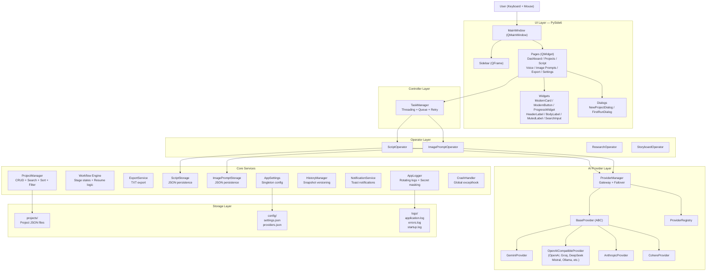
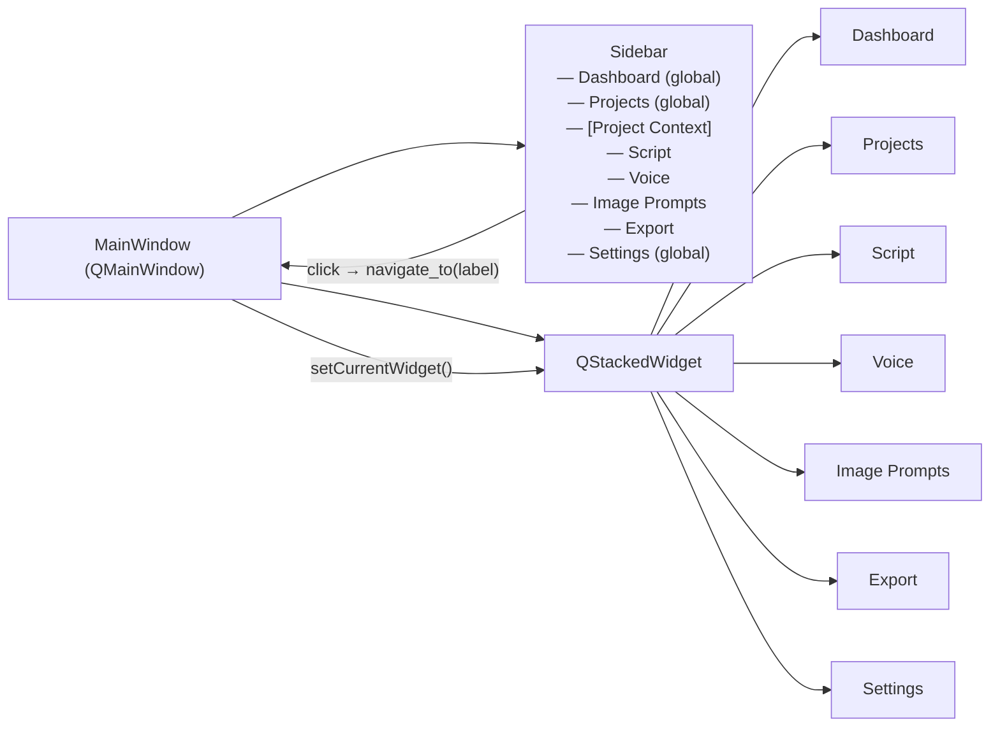
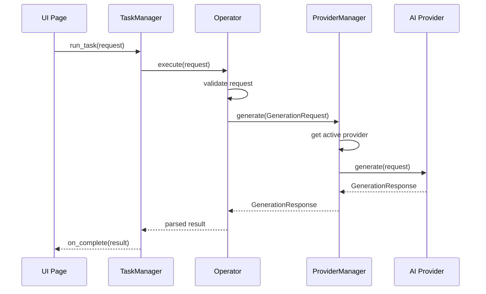

# KaiMi Studio Architecture

## Layered Architecture



## Layer Responsibilities

### UI Layer (`ui/`)
- **Renders pixels.** That is its only job.
- Pages call controllers/operators for data and display the results.
- Widgets are reusable visual components with zero business logic.
- MainWindow manages the QStackedWidget and coordinates navigation.
- Sidebar shows navigation items and project workflow progress.

### Controller Layer (`core/task_manager.py`)
- `TaskManager` runs background tasks on threads to keep the UI responsive.
- Provides queue, cancel, retry, and progress tracking.
- Bridges the gap between user actions and backend operations.

### Core Services (`core/`)
- **Business logic lives here.** Never in UI.
- `ProjectManager` — create, read, update, delete, search, sort, filter, archive, favorite.
- `Workflow` — stage state machine (LOCKED/AVAILABLE/COMPLETED), resume logic.
- `ExportService` — gathers all stage data and writes export files.
- `ScriptStorage` / `ImagePromptStorage` — JSON persistence for stage outputs.
- `AppSettings` — singleton managing `config/settings.json`.
- `HistoryManager` — timestamped snapshots with restore, compare, delete.
- `NotificationService` — toast-style notifications (currently CustomTkinter-based).
- `Logger` — rotating file logs with automatic secret masking.
- `CrashHandler` — global `sys.excepthook` that logs and shows a friendly dialog.

### Operator Layer (`operators/`)
- Operators validate inputs, build prompts, call `ProviderManager`, and parse results.
- Each operator follows the same pattern: `Request` model → `PromptBuilder` → `execute()` → `Parser`.
- Operators import from `providers/` but never from `ui/`.

### AI Provider Layer (`providers/`)
- `BaseProvider` (ABC) defines the interface: `generate()`, `validate_key()`, `list_models()`, `get_capabilities()`.
- `ProviderManager` is the single gateway. Operators call `ProviderManager.generate(GenerationRequest)`.
- Auto-failover: if the active provider fails (quota, rate limit, network), the system tries the next.
- Adding a provider = one class + one `register_provider()` call. No operator changes.

### Storage Layer
- `projects/` — one folder per project, JSON files for metadata and stage data.
- `config/` — `settings.json` (app preferences) and `providers.json` (AI provider config).
- `logs/` — rotating `application.log`, `errors.log`, `startup.log`, plus `crash.log`.

## Why Business Logic Never Belongs in UI Widgets

```python
# WRONG — business logic in a button click handler
class ScriptPage(QWidget):
    def _on_generate_clicked(self):
        api_key = "sk-..."
        response = requests.post("https://api.openai.com/v1/chat/completions", ...)
        # Now this page is coupled to OpenAI. Changing providers means rewriting the page.

# CORRECT — page delegates to an operator
class ScriptPage(QWidget):
    def generate_script(self):
        request = ScriptRequest(topic=self._topic)
        self.task_manager.run_task(
            task_func=lambda tm: self.operator.execute(request),
            on_complete=self._on_script_ready,
        )
```

1. **Testability** — Business logic in UI can't be tested without rendering the window.
2. **Reusability** — Logic embedded in one page can't be reused by another page.
3. **Maintainability** — UI changes (layout, styling) risk breaking business logic.
4. **Thread Safety** — Background threads must not touch UI objects directly.
5. **Separation of Concerns** — Each layer has one job. Mixing them creates spaghetti.

## Navigation Architecture



### Navigation Rules

- **Global items** (Dashboard, Projects, Settings) are always visible in the sidebar.
- **Project items** (Script, Voice, Image Prompts, Export) appear only when a project is open.
- `Sidebar.set_project_context()` shows the project name and workflow progress indicators.
- `MainWindow.navigate_to()` finds the page in the QStackedWidget and calls `set_project()` if the page supports it.

## Dependency Rules

```
core/  →  (nothing — core imports only stdlib and PySide6)
ui/    →  core/, ui/widgets/
operators/ → providers/, core/
providers/ → (nothing outside providers/)
```

- `core/` must never import from `ui/`.
- `ui/` pages must never import providers directly.
- `operators/` must never import from `ui/`.

## Provider Flow

