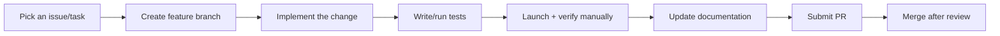
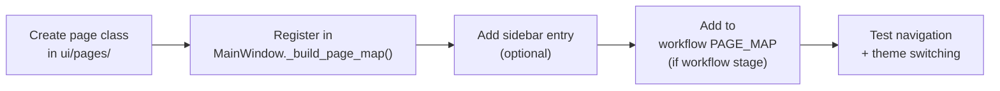

# Contributing to KaiMi Studio

## Preferred Development Workflow



1. Pick one task from the backlog or ENGINE_STATUS.
2. Create a branch: `git checkout -b feat/my-feature`.
3. Implement only that task. One task = one commit.
4. Run `pytest` and verify manually.
5. Update relevant documentation in `docs/`.
6. Commit with a clear message describing the logical change.
7. Push and submit a PR.

## Adding a New Page



**Step-by-step:**

1. Create `ui/pages/my_page.py`:

```python
from PySide6.QtWidgets import QWidget, QVBoxLayout, QLabel
from ui.theme_pyside import ThemeManager
from ui.widgets import HeaderLabel, ModernCard

class MyPage(QWidget):
    def __init__(self):
        super().__init__()
        self._build()

    def _build(self):
        layout = QVBoxLayout(self)
        layout.setContentsMargins(32, 32, 32, 32)
        layout.addWidget(HeaderLabel("My Page"))
        card = ModernCard()
        card.content_layout.addWidget(QLabel("Content here"))
        layout.addWidget(card)
        layout.addStretch()

    def set_project(self, name):
        """Called when navigating to this page with a project context."""
        pass
```

2. Register in `ui/main_window.py` `_build_page_map()`:

```python
from ui.pages.my_page import MyPage
return {
    ...
    "My Page": MyPage,
}
```

3. (Optional) Add sidebar entry in `ui/sidebar.py` `GLOBAL_ITEMS` or `STAGE_LABELS`.

4. (If workflow stage) Add to `PAGE_MAP` in `core/workflow.py`.

## Adding a Workflow Stage

1. Add stage name to `WORKFLOW_STAGES` in `core/workflow.py`.
2. Create the page class and register it (see "Adding a New Page").
3. Register in `PAGE_MAP` in `core/workflow.py` `get_resume_page_class()`.
4. Add sidebar entry in `ui/sidebar.py` `STAGE_LABELS`.
5. The resume logic automatically handles the new stage.

## Adding a Provider

```python
from providers.base_provider import BaseProvider
from providers.models import ProviderConfig, GenerationRequest, GenerationResponse

class MyCustomProvider(BaseProvider):
    def __init__(self, config: ProviderConfig):
        super().__init__(config)

    def initialize(self) -> None:
        # Create SDK client, validate config
        self._client = SomeSDK(api_key=self._config.api_key)
        self._initialized = True

    def generate(self, request: GenerationRequest) -> GenerationResponse:
        # Call the API and return a standard response
        response = self._client.generate(request.prompt)
        return GenerationResponse(text=response.text)

    def validate_key(self) -> bool:
        # Lightweight API call to verify the key
        return self._client.test_connection()

    def get_capabilities(self) -> ProviderCapabilities:
        return ProviderCapabilities(supports_text=True)

    def list_models(self) -> list[str]:
        return ["model-1", "model-2"]
```

Then register in `provider_manager.py`:

```python
def _register_builtin_providers(self):
    from providers.my_provider import MyCustomProvider
    self._registry.register("my_provider", MyCustomProvider)
```

No operator changes needed. The provider is automatically available through ProviderManager.

## Adding a Reusable Widget

1. Add the widget class to `ui/widgets/__init__.py`.
2. Use `ThemeManager.instance().colors()` for all colors.
3. Set `objectName` if it needs stylesheet targeting.
4. Call `setAttribute(Qt.WA_StyledBackground, True)` for styled widgets.

```python
class MyWidget(QFrame):
    def __init__(self, text="", parent=None):
        super().__init__(parent)
        self.setObjectName("card")
        self.setAttribute(Qt.WA_StyledBackground, True)

        layout = QVBoxLayout(self)
        layout.setContentsMargins(20, 20, 20, 20)

        c = ThemeManager.instance().colors()
        label = QLabel(text)
        label.setStyleSheet(f"color: {c.TEXT}; font-size: 14px;")
        layout.addWidget(label)
```

## Adding Settings

1. Add the default value to `_DEFAULTS` in `core/settings.py`.
2. Add a getter and setter method to `AppSettings`.
3. Access via `AppSettings().get("my_setting")` or `AppSettings().set("my_setting", value)`.

## Adding Exports

1. Add the format to `ExportService.FORMATS` in `core/export_service.py`.
2. Implement the export method (e.g., `_export_pdf()`).
3. Add the format option to `ExportPage` UI.
4. Call `export_service.export_project(data, fmt="pdf")`.

## Adding Services

1. Create the service class in `core/`.
2. The service should be stateless where possible.
3. Use `get_logger()` for logging.
4. Validate all file paths to prevent directory traversal.
5. Handle `OSError` and `json.JSONDecodeError` gracefully.

## Checklists

### New Feature Checklist

- [ ] Feature follows the project philosophy (linear workflow, minimal UI)
- [ ] One feature per commit
- [ ] Code follows CODING_STANDARDS.md
- [ ] Type hints on all public methods
- [ ] Docstrings on public methods
- [ ] No hardcoded colors (uses ThemeManager)
- [ ] No business logic in UI
- [ ] Error handling for all expected errors
- [ ] Theme switching works (Dark ↔ Light)
- [ ] Documentation updated (relevant doc in docs/)

### Bug Fix Checklist

- [ ] Bug is reproduced and understood
- [ ] Fix is minimal — only changes what's necessary
- [ ] Root cause is addressed, not just symptoms
- [ ] Test added or existing tests pass
- [ ] No new bugs introduced

### UI Checklist

- [ ] Uses ThemeManager colors (no hardcoded values)
- [ ] Uses existing widgets from ui/widgets/__init__.py
- [ ] Page is under 200 lines
- [ ] Dark and Light themes both look correct
- [ ] Layout responds to window resize
- [ ] Navigation works from sidebar
- [ ] `set_project()` method implemented (if project context)

### Provider Checklist

- [ ] Inherits from BaseProvider
- [ ] Implements all abstract methods
- [ ] Registered in ProviderManager._register_builtin_providers()
- [ ] Error types map to provider exceptions
- [ ] API key validation works
- [ ] Model listing works (if supported)
- [ ] Metadata entry in PROVIDER_METADATA

### Testing Checklist

- [ ] Operators and services have tests
- [ ] Error paths are tested
- [ ] Edge cases are covered
- [ ] Tests pass before commit

### Documentation Checklist

- [ ] New features documented in the relevant docs/ file
- [ ] ADR recorded in DECISIONS.md if architectural
- [ ] CHANGELOG updated if user-facing
- [ ] DESIGN_SYSTEM.md updated if UI changed
- [ ] ARCHITECTURE.md updated if architecture changed
- [ ] WORKFLOW.md updated if workflow changed

### Code Review Checklist

- [ ] Follows CODING_STANDARDS.md
- [ ] No duplicate code
- [ ] No business logic in UI
- [ ] Colors from ThemeManager
- [ ] Type hints and docstrings present
- [ ] Error handling is appropriate
- [ ] Tests pass
- [ ] Documentation is updated