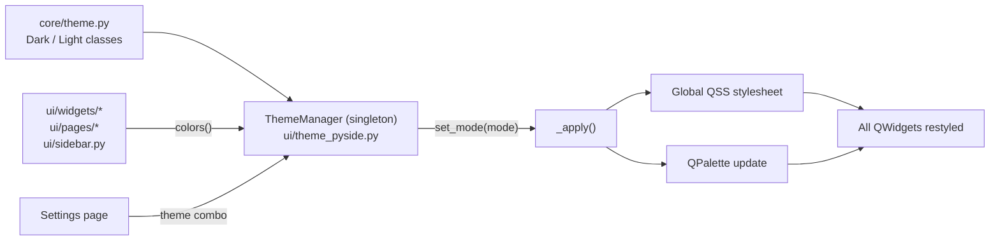

# KaiMi Studio Design System

Centralized in `core/theme.py`. Applied at runtime by `ui/theme_pyside.py` `ThemeManager`.

**Rule: Every UI component MUST read colors via `ThemeManager.instance().colors()`. Never hardcode colors.**

## Design Language

- Modern, Minimal, Premium, Professional
- Inspired by: Notion, Cursor, Figma, ChatGPT Desktop
- Dark-first with a polished Light mode
- Green primary accent (#22C55E), clean typography, generous whitespace

## Color Palette

### Dark Theme (`core/theme.py` class `Dark`)

| Token | Value | Usage |
|---|---|---|
| `BG` | `#101827` | Main window background |
| `SIDEBAR` | `#0F172A` | Sidebar background |
| `CARD` | `#1B2432` | Card/surface background |
| `BORDER` | `#263244` | Border lines |
| `SURFACE` | `#1B2432` | Secondary surface |
| `PRIMARY` | `#22C55E` | Primary accent (green) |
| `PRIMARY_HOVER` | `#16A34A` | Primary hover state |
| `PRIMARY_LIGHT` | `#0D231A` | Primary background tint |
| `SECONDARY` | `#38BDF8` | Secondary accent (blue) |
| `SUCCESS` | `#22C55E` | Success indicator |
| `WARNING` | `#F59E0B` | Warning indicator |
| `ERROR` | `#EF4444` | Error indicator |
| `TEXT` | `#F8FAFC` | Primary text |
| `TEXT_SECONDARY` | `#94A3B8` | Secondary text |
| `TEXT_MUTED` | `#64748B` | Muted/label text |
| `INPUT_BG` | `#1E293B` | Input field background |
| `INPUT_BORDER` | `#334155` | Input border |
| `INPUT_FOCUS` | `#22C55E` | Input focus ring |
| `HOVER` | `#1E293B` | Item hover |
| `ACTIVE_ITEM` | `#0D231A` | Active/selected item |
| `SCROLLBAR` | `#334155` | Scrollbar handle |
| `SCROLLBAR_HOVER` | `#475569` | Scrollbar hover |

### Light Theme (`core/theme.py` class `Light`)

| Token | Value | Usage |
|---|---|---|
| `BG` | `#F8FAFC` | Main window background |
| `SIDEBAR` | `#FFFFFF` | Sidebar background |
| `CARD` | `#FFFFFF` | Card background |
| `BORDER` | `#E5E7EB` | Border lines |
| `SURFACE` | `#F1F5F9` | Secondary surface |
| `PRIMARY` | `#22C55E` | Primary accent (green) |
| `PRIMARY_HOVER` | `#16A34A` | Primary hover |
| `TEXT` | `#111827` | Primary text |
| `TEXT_SECONDARY` | `#6B7280` | Secondary text |
| `TEXT_MUTED` | `#9CA3AF` | Muted text |

## Typography

Defined in `core/theme.py` class `Fonts`. Family: `"Segoe UI", "Inter", sans-serif`.

| Token | Size | Weight | Usage |
|---|---|---|---|
| `TITLE` | 32px | Bold | Page titles |
| `SECTION` | 22px | Semibold | Section headers |
| `CARD_TITLE` | 18px | Medium | Card titles |
| `HEADING` | 22px | Semibold | Settings headings |
| `BODY` | 14px | Normal | Body text |
| `BODY_BOLD` | 14px | Bold | Emphasized body |
| `SMALL` | 12px | Normal | Labels, metadata |
| `SMALL_BOLD` | 12px | Bold | Emphasized labels |
| `TINY` | 11px | Normal | Badges, timestamps |
| `BUTTON` | 14px | Bold | Button text |
| `INPUT` | 14px | Normal | Input field text |

## Spacing System

Defined in `core/theme.py` class `Spacing`. Base unit: 4px.

| Token | Value | Usage |
|---|---|---|
| `X1` | 4px | Micro spacing |
| `X2` | 8px | Tight spacing |
| `X3` | 12px | Default padding |
| `X4` | 16px | Card padding |
| `X6` | 24px | Section spacing |
| `X8` | 32px | Large margins |
| `X10` | 40px | Page margins |
| `X12` | 48px | XL spacing |

## Corner Radius

Defined in `core/theme.py` class `Radius`.

| Token | Value | Usage |
|---|---|---|
| `SM` | 8px | Progress bars, small items |
| `MD` | 12px | Navigation items, toasts |
| `LG` | 16px | Cards, sidebar, dialogs |
| `XL` | 20px | Large containers |
| `FULL` | 9999px | Pill shapes |

## Window Layout

Defined in `core/theme.py` class `Layout`.

| Token | Value |
|---|---|
| `WINDOW_WIDTH` | 1600px |
| `WINDOW_HEIGHT` | 1000px |
| `SIDEBAR_WIDTH` | 240px |
| `SIDEBAR_COLLAPSED` | 64px |
| `TOPBAR_HEIGHT` | 56px |
| `CARD_MIN_HEIGHT` | 120px |

## Components

### ModernCard (`ui/widgets/__init__.py`)
- QFrame with objectName `"card"`
- Border: 1px solid `BORDER`, radius: 16px
- Background: `CARD`
- Drop shadow: blur 30px, offset (0, 2)
- Hover: border becomes `PRIMARY`, shadow intensifies
- Padding: 20px

### ModernButton (`ui/widgets/__init__.py`)
- Height: 40px
- Variants:
  - **Primary** (default): `PRIMARY` background, white text
  - **Secondary**: transparent, `BORDER` stroke, `TEXT` color
  - **Danger**: `ERROR` background
  - **Ghost**: transparent, `TEXT_SECONDARY` color
- Border radius: 16px
- Hover: `PRIMARY_HOVER` for primary, `PRIMARY` border for secondary
- Cursor: pointing hand

### Inputs (styled via global stylesheet in `theme_pyside.py`)
- QLineEdit, QPlainTextEdit, QComboBox
- Background: `INPUT_BG`, border: 1px solid `INPUT_BORDER`
- Border radius: 16px, padding: 10px 16px, font: 14px
- Focus: 2px solid `INPUT_FOCUS`

### ProgressWidget (`ui/widgets/__init__.py`)
- QProgressBar: height 12px, radius 8px
- Chunk: `PRIMARY` fill
- Status label + percentage + step label + ETA label

### Sidebar (`ui/sidebar.py`)
- Width: 240px, objectName `"sidebar"`
- Background: `SIDEBAR`, border: 1px solid `BORDER`, radius: 16px
- Navigation items: height 40px, radius 12px, hover `HOVER`
- Active item: `PRIMARY_LIGHT` background, `PRIMARY` text

### Dialog styles
- QDialog: `BG` background, centered content
- Cards inside dialogs use same `CARD` / `BORDER` tokens
- Buttons follow ModernButton variants

## Icons

Icons are Unicode/emoji characters (not icon fonts or SVGs):

| Location | Icon |
|---|---|
| Dashboard | 🏠 |
| Projects | 📁 |
| Script | 📝 |
| Voice | 🎤 |
| Image Prompts | 🖼 |
| Export | 📤 |
| Settings | ⚙ |
| Completed | ✓ (green) |
| Available | ● (primary) |
| Locked | ○ (muted) |

## Animations

- Fast and subtle. Never distracting.
- Card hover: border color change + shadow intensification (immediate, no transition).
- Sidebar hover: background color change.
- No loading spinners — use ProgressWidget with real progress updates.
- Theme switch: instant palette swap (no fade transition).

## Theme System Flow

## Creating a New Component

1. Read colors from `ThemeManager.instance().colors()`.
2. Use existing widgets from `ui/widgets/__init__.py` when possible.
3. Add styles to the global stylesheet in `theme_pyside.py` `_stylesheet()`.
4. If a new widget is needed, add it to `ui/widgets/__init__.py` following the existing patterns.
5. Update this document.