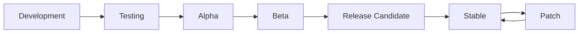

# KaiMi Studio Release Process

## Release Stages



### Development
- Active feature development on feature branches
- Code review required before merging
- All tests must pass
- Documentation must be updated

### Testing
- Feature-freeze: only bug fixes and polish
- Full test suite run
- Manual QA on all workflows
- Performance benchmarks reviewed

### Alpha
- Internal testing only
- Known bugs are documented
- Core workflow must be functional
- Theme switching must work
- No crashes on basic operations

### Beta
- External testers invited
- API complete — no breaking changes
- All features implemented
- Documentation complete
- Known issues documented

### Release Candidate
- Release branch created
- Version bumped in `core/version.py`
- Full regression test
- Build tested on clean environment
- Changelog finalized

### Stable
- Tagged release on main branch
- PyInstaller build created
- Release notes published
- All checklists completed

### Patch
- Branch from the release tag
- Fix only the critical bug
- Bump PATCH version
- Rebuild and release

## Version File

Version is defined in `core/version.py`:

```python
VERSION = "1.0.0"
BUILD = "Release"
CODENAME = "Aurora"
```

## Build Process

```bash
# Install dependencies
pip install -r requirements.txt

# Run tests
pytest

# Build with PyInstaller
python build.py
```

## Release Checklist

### Before Every Release
- [ ] Version bumped in `core/version.py`
- [ ] `CHANGELOG.md` updated with release notes
- [ ] All tests pass: `pytest`
- [ ] Application launches without errors
- [ ] Theme switching works (Dark ↔ Light)
- [ ] All 5 workflow stages function end-to-end
- [ ] Provider configuration works
- [ ] Export produces correct output
- [ ] Documentation is current

### Alpha Checklist
- [ ] Core workflow (Project → Script → Voice → Image Prompts → Export) works
- [ ] At least one AI provider is configured and working
- [ ] Projects can be created, saved, and reopened
- [ ] No crashes on normal usage
- [ ] Error messages are user-friendly

### Beta Checklist
- [ ] All features implemented
- [ ] Settings persist across sessions
- [ ] Theme switching complete
- [ ] Project management (search, sort, filter, archive, favorite) works
- [ ] Export produces accurate output
- [ ] Backup/restore works

### RC Checklist
- [ ] Full regression test passed
- [ ] No known critical bugs
- [ ] Documentation complete
- [ ] PyInstaller build verified on clean system
- [ ] Performance within acceptable range
- [ ] Security review completed

### Stable Checklist
- [ ] RC checklist completed
- [ ] Tag created: `git tag v<version>`
- [ ] Release notes published
- [ ] Build artifacts attached
- [ ] `CHANGELOG.md` finalized

## Hotfix Process

For critical bugs discovered after release:

1. `git checkout -b hotfix/<description> <release-tag>`
2. Fix the bug with minimal changes
3. Bump PATCH version in `core/version.py`
4. Update `CHANGELOG.md`
5. Test thoroughly
6. Build and release as a patch
7. Merge hotfix back to main