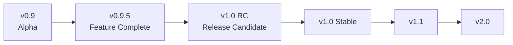

# KaiMi Studio Versioning Strategy

## Semantic Versioning

KaiMi Studio follows strict semantic versioning: `MAJOR.MINOR.PATCH`

```
v1.0.0
 ↑  ↑  ↑
 |  |  └── PATCH: Bug fixes, minor improvements
 |  └───── MINOR: New features, backward compatible
 └──────── MAJOR: Breaking changes, major rewrites
```

### MAJOR Version Bump

Required when:
- Breaking architectural changes
- Incompatible file format changes
- Dropping support for a provider interface
- UI framework migration

### MINOR Version Bump

Required when:
- New workflow stage added
- New export format added
- New provider type added
- New feature that changes user experience
- Deprecation of existing features

### PATCH Version Bump

Required when:
- Bug fixes
- Performance improvements
- UI polish
- Documentation updates
- Internal refactoring (no behavior change)

## Version Lifecycle



### Current Version

`v1.0.0` "Aurora" — Production Release

### Pre-release Suffixes

| Suffix | Meaning | Example |
|---|---|---|
| `a` | Alpha | `v0.9a` |
| `b` | Beta | `v0.9.5b` |
| `rc` | Release Candidate | `v1.0rc2` |

## Version Location

The single source of truth for version information is `core/version.py`:

```python
VERSION = "1.0.0"
BUILD = "Release"
CODENAME = "Aurora"
```

## Codename Convention

Each stable release has a codename. Codenames are assigned alphabetically:

| Version | Codename |
|---|---|
| v1.0.0 | Aurora |
| v1.1.0 | (next codename) |

## Future Version Roadmap

| Version | Focus |
|---|---|
| v1.1.0 | Research integration, storyboard |
| v1.2.0 | PDF/SRT export, installer + code signing |
| v2.0.0 | Plugin system, batch processing |