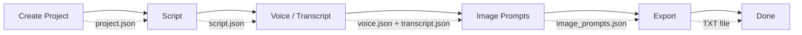
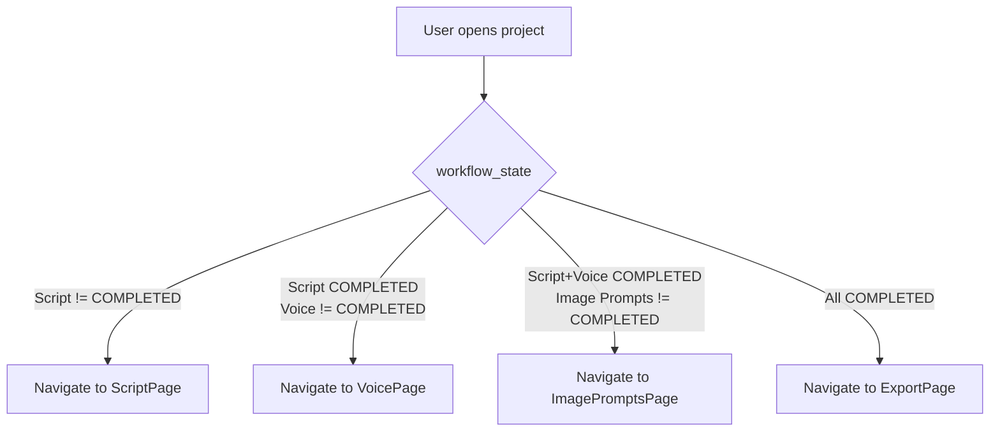
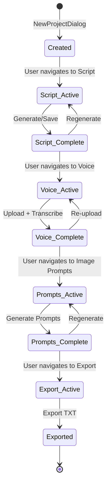

# KaiMi Studio Creator Workflow

## The 5-Stage Workflow

## Stage Details

### Stage 1: Create Project

**Inputs:** Project name, topic, platform (YouTube/TikTok/Instagram/Other), video type, language, format (Long Form/Shorts)

**UI:** NewProjectDialog (`ui/dialogs/__init__.py`)

**Files created:**
- `projects/<name>/project.json` — project metadata
- `projects/<name>/audio/` — empty audio directory
- `projects/<name>/exports/` — empty exports directory
- `projects/<name>/history/` — empty history directory

**Workflow state:** `{"Script": "AVAILABLE", "Voice": "LOCKED", "Image Prompts": "LOCKED", "Export": "LOCKED"}`

### Stage 2: Script

**Inputs:** Topic, platform, video type, language, script mode, script length (min/max), duration preset, research sources, keywords (from `project.json`)

**Process:**
1. `ScriptPage` builds a `ScriptRequest` from project data
2. `TaskManager` runs `ScriptOperator.execute()` on a background thread
3. `ScriptOperator` validates the request, builds prompts via `ScriptPromptBuilder`, calls `ProviderManager.generate()`
4. Result is written to `script.json` via `ScriptStorage.save()`
5. Workflow state advances: Script → COMPLETED, Voice → AVAILABLE

**Output:** `projects/<name>/script.json` — `{"script_output": "...", "script_mode": "...", ...}`

**UI support:**
- Progress animation (6 stages: Researching → Finding sources → Analyzing → Writing → Improving → Finalizing)
- Editable script editor (QPlainTextEdit)
- Save, regenerate, character/word count
- Dirty state tracking with unsaved indicator

### Stage 3: Voice / Transcript

**Inputs:** Audio file (MP3, WAV, or M4A), optional save of transcript text

**Process:**
1. User selects an audio file via `QFileDialog`
2. File is copied to `projects/<name>/audio/`
3. Whisper model transcribes the audio on a background thread (`TranscribeWorker`)
4. Result saved to `voice.json` (transcript + segments with timestamps) and `transcript.json`
5. Workflow state advances: Voice → COMPLETED, Image Prompts → AVAILABLE

**Output:**
- `projects/<name>/voice.json` — `{"transcript": "...", "segments": [...], "audio_file": "..."}`
- `projects/<name>/transcript.json` — `{"text": "..."}`

**UI support:**
- File chooser, transcribe button, progress indicator
- Editable transcript with save/download
- Timestamp metadata display

### Stage 4: Image Prompts

**Inputs:** Script text, transcript text, timestamps, topic, language

**Process:**
1. `ImagePromptsPage` loads script from `script.json` and transcript from `voice.json`/`transcript.json`
2. `TaskManager` runs `ImagePromptOperator.execute()` on background thread
3. `ImagePromptOperator` builds prompts via `ImagePromptBuilder`, calls `ProviderManager.generate()`
4. Raw output is parsed by `ImagePromptParser` into structured scene prompts
5. Result saved to `image_prompts.json`
6. Workflow state advances: Image Prompts → COMPLETED, Export → AVAILABLE

**Output:** `projects/<name>/image_prompts.json` — `{"prompts": [{"scene_number": 1, "timestamp": "00:00", "prompt_title": "...", "full_image_prompt": "..."}, ...]}`

**UI support:**
- Scrollable list of prompt cards
- Each card shows scene number, timestamp, full prompt text (read-only)
- Copy-to-clipboard per prompt
- Generate and Export TXT buttons

### Stage 5: Export

**Inputs:** All project data + stage data

**Process:**
1. `ExportPage` loads project data and all stage files
2. `ExportService.export_project()` gathers everything into a structured format
3. Currently supports TXT format (output includes project metadata, script, transcript, and image prompts)
4. File saved to `projects/<name>/exports/<name>/<name>.txt`

**Output:** `projects/<name>/exports/<name>/<name>.txt`

**UI support:**
- Project info card, export button
- Workflow progress visualization
- Export history display

## Resume Logic

The resume system picks up exactly where the user left off:

Implementation in `core/workflow.py`:
- `get_next_pending_state(workflow_state)` — finds the first stage not yet COMPLETED
- `get_resume_page_class(workflow_state)` — returns the page class for that stage
- `PAGE_MAP` — lazy-loaded mapping of stage names to page classes

## Project Lifecycle

## Resume Behavior on Dashboard/Projects

Both `DashboardPage` and `ProjectsPage` use `get_resume_page_class()` to navigate:
1. User clicks "Resume" on a project card
2. System loads `workflow_state` from `project.json`
3. `get_resume_page_class()` returns the first incomplete stage
4. `MainWindow.navigate_to()` switches to that page
5. The page receives the project name via `set_project()`

## Future Workflow Expansion

The workflow engine supports adding new stages:
1. Add the stage name to `WORKFLOW_STAGES` in `core/workflow.py`
2. Create a page class and register in `PAGE_MAP`
3. Add sidebar entry (optional)
4. The resume logic automatically handles the new stage

Planned stages: Research (internal), Storyboard, PDF/SRT/ZIP export.